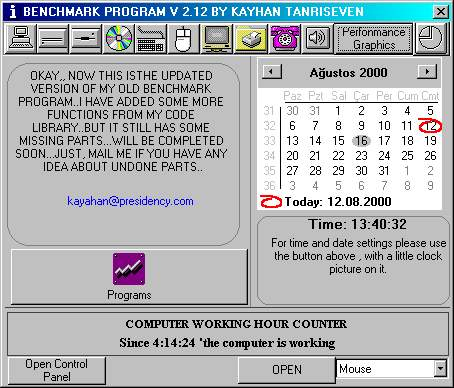



## Benchmark V2\.1

### Description

SORRY GUYS...I FIXED SOME ACTIVEX DLLS AND SO ON...NOW ITS COMPLETELY BUG FREE.....(WILL USE THOSE ACTIVEX COMPONENTS IN UPDATED VERSIONS..)and Graphics part , I have added some cooler math functions...
 
### More Info
 

             |
---                |---
**Submitted On**   |2000-08-18 12:19:42
**By**             |[VbNick](https://github.com/Planet-Source-Code/PSCIndex/blob/master/ByAuthor/vbnick.md)
**Level**          |Advanced
**User Rating**    |4.3 (39 globes from 9 users)
**Compatibility**  |VB 5\.0, VB 6\.0
**Category**       |[Complete Applications](https://github.com/Planet-Source-Code/PSCIndex/blob/master/ByCategory/complete-applications__1-27.md)
**World**          |[Visual Basic](https://github.com/Planet-Source-Code/PSCIndex/blob/master/ByWorld/visual-basic.md)
**Archive File**   |[CODE\_UPLOAD99199152000\.zip](https://github.com/Planet-Source-Code/vbnick-benchmark-v2-1__1-11500/archive/master.zip)

### API Declarations

in the project

